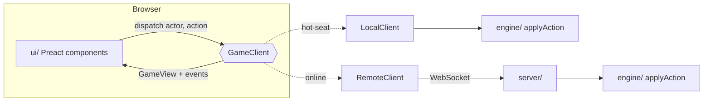
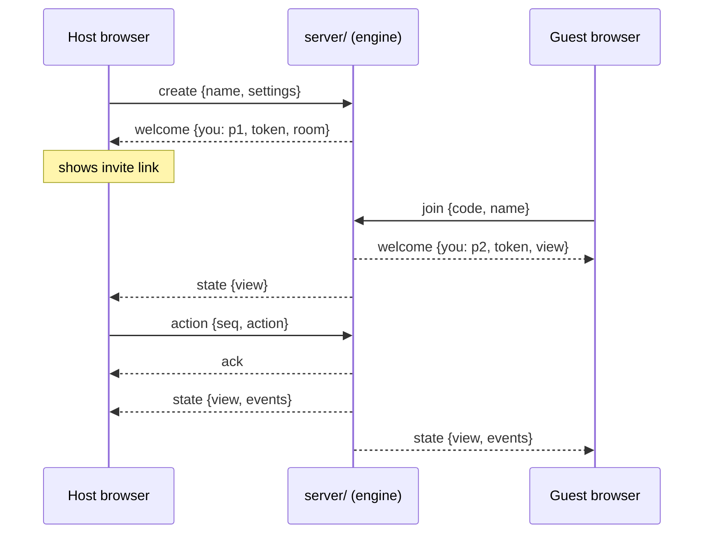

# Architecture

The game is split so that the rules never touch the DOM and the UI never touches the rules' internals. Online play reuses the exact same rules code on the server, which is authoritative.



## `src/engine/` — pure rules

- `chess.ts` — board representation, legal move generation (validated with perft), bughouse drops, SAN. Knows nothing about cards or turns.
- `cards.ts` — the 108-card deck, card effects, and a seeded RNG (mulberry32) for shuffling.
- `game.ts` — the whole variant as a reducer: `applyAction(state, actor, action) → { state, events }`.
  - `GameState` is plain JSON (no classes, no functions), so it can be saved to `localStorage`, sent over a socket, or stored in a database as-is.
  - Deterministic given its seed: the same seed and action list always produce the same game. A server can replay or audit a game from its action log.
  - Every action names its `actor` (`'p1' | 'p2'`), and the engine checks it's that player's turn. Illegal actions throw `GameError` with a user-facing message and leave the input state untouched.
  - `events` describe what happened (card drawn, reverse, turn ended because of check, game over…) so the UI can animate and announce without diffing states.
  - Players and armies are separate: `armies: { w: PlayerId, b: PlayerId }`. Reverse swaps the armies; `turn` stays a color.

## `src/net/` — the seam between UI and game

`GameClient` is the only thing the UI talks to:

```ts
interface GameClient {
  readonly localPlayers: readonly PlayerId[]; // both in hot-seat, one online
  getView(): GameView;
  subscribe(listener: (view: GameView, events: GameEvent[]) => void): () => void;
  dispatch(actor: PlayerId, action: Action): Promise<DispatchResult>;
}
```

- The UI only ever receives a `GameView` (`toView(state)`), which strips the deck order and RNG state. Hot-seat play goes through the same redaction, so the UI can't depend on hidden information.
- The UI only lets you act when `localPlayers` includes the player whose turn it is. Draw offers and resignations are routed to local players only.
- `LocalClient` (hot-seat) runs the engine in the page and saves to `localStorage` after every action.
- `RemoteClient` (online) sends actions to the server and applies its broadcasts. It reconnects with backoff and resumes its seat with a stored token.

## Online play



- `src/net/protocol.ts` defines every message, and both sides import it.
- `server/rooms.ts` (`RoomManager`) holds rooms and seats. It doesn't know about sockets, so it can be unit-tested.
  - The actor for each action comes from the connection's seat, never from the message.
  - An action sent against a stale `seq` is rejected, so a retried or duplicated action can't apply twice.
  - A second tab for the same seat replaces the first.
- `server/store.ts` writes one JSON file per room atomically, batched, and flushed on SIGTERM.
- `server/main.ts` does HTTP (`/healthz`), the WebSocket upgrade on `/ws` with an Origin allow-list, per-connection rate limits and heartbeats.
- Node 24 runs the server's TypeScript directly (type stripping). That's why imports carry `.ts` extensions and tsconfig sets `erasableSyntaxOnly`.
- The browser finds the server through `VITE_SERVER_URL`, baked in at build time. When it's empty, online play is hidden.

Hosting and operations are covered in [services/unochess/README.md](services/unochess/README.md).

## `src/ui/`

- `GameScreen.tsx` — interaction state (selection, drag, promotion picker, overlays), board orientation and the Reverse spin.
- `Board.tsx` — squares plus an absolutely-positioned piece layer keyed by piece id, so moves animate via CSS transitions.
- `CardTable.tsx`, `UnoCard.tsx` — deck, discard pile, flip animation, turn prompt. Cards are drawn in SVG.
- `PlayerBar.tsx`, `TurnLog.tsx`, `Modals.tsx`, `Setup.tsx`, `text.ts` (all user-facing wording for engine concepts).

## Testing

- `tests/chess.test.ts` — perft on five standard positions, plus the multi-move edge cases (own-pawn en passant, castling rights, drops).
- `tests/game.test.ts` — every card type against a stacked deck, check-ends-turn, mate/stalemate, drops while in check, reshuffling, and a soak test that plays random legal actions through many seeded games.
- `tests/server.test.ts` — a real server on a random port with real WebSocket clients: create/join/sync, out-of-turn, stale and malformed actions, token resume and imposters, tab replacement, persistence across restart, rate limiting, Origin checks, rematch.
- `e2e/drive.mjs` — screenshot-driven browser checks (see README). `e2e/online.mjs` plays an online game between two isolated browsers, including a disconnect and (with `RESTART_CMD`) a server restart.
