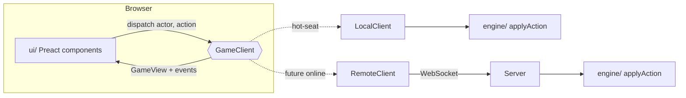

# Architecture

The game is split so that the rules never touch the DOM and the UI never touches the rules' internals. That split is what makes online play a matter of adding a server and one client class.



## `src/engine/` — pure rules

- `chess.ts` — board representation, legal move generation (validated with perft), bughouse drops, SAN. Knows nothing about cards or turns.
- `cards.ts` — the 108-card deck, card effects, and a seeded RNG (mulberry32) for shuffling.
- `game.ts` — the whole variant as a reducer: `applyAction(state, actor, action) → { state, events }`.
  - `GameState` is plain JSON (no classes, no functions), so it can be saved to `localStorage`, sent over a socket, or stored in a database as-is.
  - Deterministic given its seed: the same seed and action list always produce the same game. A server can replay or audit a game from its action log.
  - Every action names its `actor` (`'p1' | 'p2'`), and the engine checks it's that player's turn. Illegal actions throw `GameError` with a user-facing message and leave the input state untouched.
  - `events` describe what happened (card drawn, reverse, turn ended because of check, game over…) so the UI can animate and announce without diffing states.
  - Players and armies are separate: `armies: { w: PlayerId, b: PlayerId }`. Reverse swaps the armies; `turn` stays a color.

## `src/net/` — the seam for online play

`GameClient` is the only thing the UI talks to:

```ts
interface GameClient {
  readonly localPlayers: readonly PlayerId[]; // both in hot-seat, one online
  getView(): GameView;
  subscribe(listener: (view: GameView, events: GameEvent[]) => void): () => void;
  dispatch(actor: PlayerId, action: Action): Promise<DispatchResult>;
}
```

- The UI only ever receives a `GameView` (`toView(state)`), which strips the deck order and RNG state. Hot-seat play already goes through that redaction, so the UI can't accidentally depend on hidden information.
- `dispatch` is async even locally, so a network round trip is a drop-in change.
- The UI only lets you act when `localPlayers` includes the player whose turn it is, and draw offers / resignations are routed to local players only.

`LocalClient` runs the engine in the page and saves to `localStorage` after every action.

## Adding online play

1. **Server** (e.g. a small Node `ws` server, or Cloudflare Durable Objects — one object per game). It imports `src/engine/` unchanged, holds the authoritative `GameState` per room, and maps each connection to a `PlayerId` via a join token.
2. **Protocol:**
   - client → server: `{ type: 'action', seq, action }` (the server derives `actor` from the connection, never from the message)
   - server → both clients: `{ type: 'state', view: toView(state), events }`, or `{ type: 'rejected', error }` to the sender
   - `seq` is `GameState.seq`; the server can reject actions sent against a stale state.
3. **`RemoteClient implements GameClient`** with `localPlayers = [myPlayerId]`, forwarding `dispatch` over the socket and feeding broadcasts to listeners. On reconnect, the server just resends the current view.
4. **UI tweaks:** default the board orientation so the local player sits at the bottom (`bottomSeat` in `GameScreen.tsx`), add a lobby/invite link, and show a "waiting for opponent" state when it isn't your turn (the prompt already renders; inputs are already disabled).

Nothing in `engine/` or the existing UI components needs to change for this.

## `src/ui/`

- `GameScreen.tsx` — interaction state (selection, drag, promotion picker, overlays), board orientation and the Reverse spin.
- `Board.tsx` — squares plus an absolutely-positioned piece layer keyed by piece id, so moves animate via CSS transitions.
- `CardTable.tsx`, `UnoCard.tsx` — deck, discard pile, flip animation, turn prompt. Cards are drawn in SVG.
- `PlayerBar.tsx`, `TurnLog.tsx`, `Modals.tsx`, `Setup.tsx`, `text.ts` (all user-facing wording for engine concepts).

## Testing

- `tests/chess.test.ts` — perft on five standard positions, plus the multi-move edge cases (own-pawn en passant, castling rights, drops).
- `tests/game.test.ts` — every card type against a stacked deck, check-ends-turn, mate/stalemate, drops while in check, reshuffling, and a soak test that plays random legal actions through many seeded games.
- `e2e/drive.mjs` — screenshot-driven browser checks (see README).
